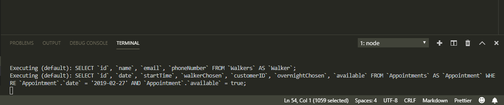

# Dog-Go

We're your dog's other best friend. We've created an app that allows customers to make appointments from local dog walkers. Check it out deployed on heroku. https://blooming-spire-98049.herokuapp.com/ 

## Showing off

Here are some shots of our layout and flow.





### Prerequisites

To access the app you will need to install::
Node
Express
Handlebars
mySql
Sequelize
Popmotion
Moment
```

You will also need to use mySql Workbench

## Built With

* [LESS](http://www.dropwizard.io/1.0.2/docs/) - The CSS framework used/New Technology
* [NODE](https://nodejs.org/en/) - Node is designed to build scalable network applications
* [NPM](https://www.npmjs.com/) - Used to install components
* [mySql](https://www.mysql.com/) - Database Managment

## Authors

* **Maria Maniccia** - *Backend* - [Maria](https://mariamaniccia.github.io/)
* **Jennifer Mazanec** - *Backend* - [Jennifer](https://jenmaz12.github.io/Portfolio/)
* **Matthew McGee** - *Frontend* - [Matthew](#)
* **Enrique Sandino** - *Frontend* - [Enrique](#)


## License

This project is licensed under the MIT License - see the [LICENSE.md](LICENSE.md) file for details

## Acknowledgments

* Tom Seeber
* Byron Brown
* Anderw Clavin
* JJ D'Aurora
* Tom Renicker
